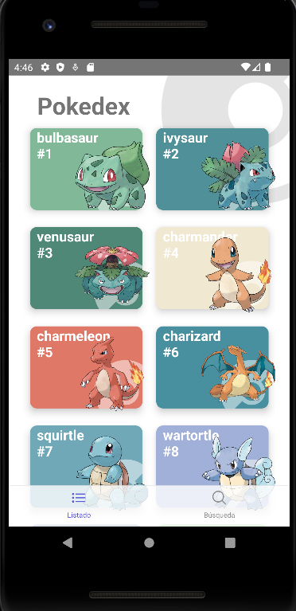
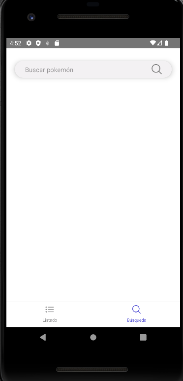
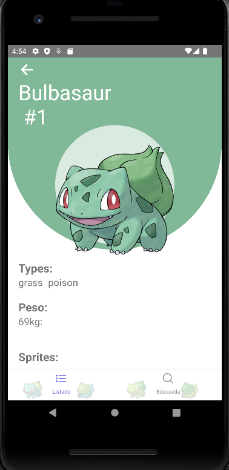

# Pokedex
In this repository you'll find a Pokedex build with React Native. This project as it names said is an app where you'll find all the Pokemons that exist.

In the first page you'll find a list of all of them like i show you here:
## Screens
| First Screen - List                                 | Second Screen - Search                              |
| --------------------------------------------------- | --------------------------------------------------- |
|  |  |
| Pokemon Screen                                      | Pokemon Screen - More Information                   | Pokemon Screen - More Information |

|  |  |   |

As you can see the application count with three main screens